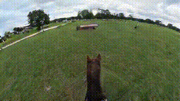

## Generating Long Videos of Dynamic Scenes (LongVideoGAN) <br><sub>Official PyTorch code release for this paper: https://arxiv.org/abs/2206.03429</sub>

 

**Generating Long Videos of Dynamic Scenes**<br>
Tim Brooks, Janne Hellsten, Miika Aittala, Ting-Chun Wang, Timo Aila, Jaakko Lehtinen, Ming-Yu Liu, Alexei A. Efros, Tero Karras<br>
https://www.timothybrooks.com/tech/long-video-gan<br>

Abstract: *We present a video generation model that accurately reproduces object motion, changes in camera viewpoint, and new content that arises over time. Existing video generation methods often fail to produce new content as a function of time while maintaining consistencies expected in real environments, such as plausible dynamics and object persistence. A common failure case is for content to never change due to over-reliance on inductive biases to provide temporal consistency, such as a single latent code that dictates content for the entire video. On the other extreme, without long-term consistency, generated videos may morph unrealistically between different scenes. To address these limitations, we prioritize the time axis by redesigning the temporal latent representation and learning long-term consistency from data by training on longer videos. To this end, we leverage a two-phase training strategy, where we separately train using longer videos at a low resolution and shorter videos at a high resolution. To evaluate the capabilities of our model, we introduce two new benchmark datasets with explicit focus on long-term temporal dynamics.*

## Requirements

* Linux and Windows are supported, but we recommend Linux for performance and compatibility reasons.
* 1+ high-end NVIDIA GPU for synthesis and 8+ GPUs for training. We have done all testing and development using V100 and A100 GPUs.
* CUDA toolkit 11.1 or later.
* GCC 7 or later (Linux) or Visual Studio (Windows) compilers.  Recommended GCC version depends on CUDA version, see for example [CUDA 11.4 system requirements](https://docs.nvidia.com/cuda/archive/11.4.1/cuda-installation-guide-linux/index.html#system-requirements).
* Python libraries: see [environment.yml](./environment.yml) for exact library dependencies.  You can use the following commands with Miniconda3 to create and activate your LongVideoGAN Python environment:
  - `conda env create -f environment.yml -n long-video-gan`
  - `conda activate long-video-gan`

The code relies heavily on custom PyTorch extensions that are compiled on the fly using NVCC. On Windows, the compilation requires Microsoft Visual Studio. We recommend installing [Visual Studio Community Edition](https://visualstudio.microsoft.com/vs/) and adding it into `PATH` using `"C:\Program Files (x86)\Microsoft Visual Studio\<VERSION>\Community\VC\Auxiliary\Build\vcvars64.bat"`.

See [StyleGAN3 troubleshooting](https://github.com/NVlabs/stylegan3/blob/main/docs/troubleshooting.md) for help on common installation and run-time problems.

## Generating videos

Pre-trained models are stored as `*.pkl` files. You can download our pre-trained checkpoints for horseback riding and mountain biking datasets, or load models directly from their URL. Make sure you have set up the required Python environment before generating videos.

- [LongVideoGAN pre-trained models](https://nvlabs-fi-cdn.nvidia.com/long-video-gan/pretrained/)
  > <sub>`hourseback_lres.pkl`</sub><br>
  > <sub>`hourseback_sres.pkl`</sub><br>
  > <sub>`biking_lres.pkl`</sub><br>
  > <sub>`biking_sres.pkl`</sub><br>

Generate high-resolution video using pre-trained horseback riding model:
```.bash
python generate.py --outdir=outputs/horseback --seed=49 \
    --lres=https://nvlabs-fi-cdn.nvidia.com/long-video-gan/pretrained/horseback_lres.pkl \
    --sres=https://nvlabs-fi-cdn.nvidia.com/long-video-gan/pretrained/horseback_sres.pkl
```

Generate low-resolution video using pre-trained horseback riding model:
```.bash
python generate.py --outdir=outputs/horseback --seed=49 --save-lres=True \
    --lres=https://nvlabs-fi-cdn.nvidia.com/long-video-gan/pretrained/horseback_lres.pkl
```

Generate low- and high-resolution videos and frame images using pre-trained mountain biking model:
```.bash
python generate.py --outdir=outputs/biking --seed=41 --save-lres=True -i 0 -i 15 -i 30 -i 60 -i 150 -i 300 \
    --lres=https://nvlabs-fi-cdn.nvidia.com/long-video-gan/pretrained/biking_lres.pkl \
    --sres=https://nvlabs-fi-cdn.nvidia.com/long-video-gan/pretrained/biking_sres.pkl
```

You can use pre-trained networks in your own Python code. Please refer to the `generate.py` file for a minimal example.

To run our pretrained models requires `torch_utils` and `dnnlib` to be accessible via `PYTHONPATH`. It does not need source code for the networks themselves &mdash; their class definitions are loaded from the pickle via `torch_utils.persistence`.

The pickle files directly load the `'G_ema'` network that is a moving average of the generator weights over several training steps. The network is a regular instance of `torch.nn.Module`, with all parameters and buffers placed on the CPU at import and gradient computation disabled by default.

Note that to generate very long videos without running out of memory, we recommend generating videos in chunks of shorter segments. In `generate.py`, we run the super-resolution network over in chunks by calling `sres_G.sample_video_segments(...)` rather than `sres_G(...)` directly. The low res network can similarly be called using `lres_G.sample_video_segments(...)` if you would like to generate longer videos and run into memory issues.

## Preparing datasets

We release two new video datasets of horseback riding and mountain biking videos that can be downloaded directly from the links below. Thank you to [Elisa Wallace Eventing](https://www.youtube.com/c/WallaceEventing) and [Brian Kennedy](https://www.youtube.com/c/bkxc) for kindly allowing us to make datasets from their videos.

We have preprocessed the video datasets into frames at many resolutions. Under each dataset directory are many subdirectories with the corresponding resolution -- we recommend only downloading the specific resolutions you plan to use. In our paper, we only use 144x256 and 36x64 resolutions.

- https://nvlabs-fi-cdn.nvidia.com/long-video-gan/datasets/
- https://nvlabs-fi-cdn.nvidia.com/long-video-gan/datasets/horseback/0144x0256/
- https://nvlabs-fi-cdn.nvidia.com/long-video-gan/datasets/horseback/0036x0064/
- https://nvlabs-fi-cdn.nvidia.com/long-video-gan/datasets/biking/0144x0256/
- https://nvlabs-fi-cdn.nvidia.com/long-video-gan/datasets/biking/0036x0064/

The video datasets are stored in shards of uncompressed ZIP archives containing frames as compressed JPG images (with 100% quality and no color subsampling). The source YouTube videos links and time intervals used to create the horseback riding and mountain biking datasets can be found in `dataset_tools/youtube_configs`.

To create your own video dataset in this format, see the `dataset_tools` directory. Make sure you have set up the required Python environment before creating the dataset. Then run the appropriate `dataset_tools/make_datase_from_*` script, depending on if your dataset source is directories of frame images, video files, or YouTube video metadata. See the example below, and make sure to run the script separately for each shard/partition.

```.bash
python -m dataset_tools.make_dataset_from_videos SOURCE_VIDEOS_DIR OUTPUT_DATASET_DIR \
    --height=144 --width=256 --partition=0 --num-partitions=10
```

Setting `--partition=0 --num-partitions=10` (default) in the above example will produce a single shard of the dataset as one ZIP archive containing roughly 1/10 of the videos. You must run the command separately for each partition from 0 to 9 to create all shards. For a small dataset you can set `--num-partitions=1` and for very large datasets you can set it to be larger than 10. Breaking the dataset into shards allows each shard to be created at the same time in parallel, or for creation of the shards to be distributed over different machines. See `dataset_tools/make_dataset_sbatch.sh` for an example of how to run dataset creation in parallel in a Slurm job.

## Training

You can train new models using `train_lres.py` to train the low resolution network and `train_sres.py` to train the super-resolution network. We recommend using at least 8 high-end NVIDIA GPUs for training, if possible. If that is not possible or you run out of memory, you can try increasing the number of gradient accumulation steps (`--grad-accum`), which will train more slowly but use less memory. You may also experiment with lowering the batch size (`--batch`), although this may worsen results. For multi-GPU training, we use [torchrun](https://pytorch.org/docs/stable/elastic/run.html).

Distributed low-resolution training over 8 GPUs on horseback riding dataset:
```.bash
python -m torch.distributed.run --nnodes=1 --nproc_per_node=8 train_lres.py \
    --outdir=runs/lres --dataset=datasets/horseback --batch=64 --grad-accum=2 --gamma=1.0 --metric=fvd2048_128f
```

Distributed super-resolution training over 8 GPUs on horseback riding dataset:
```.bash
python -m torch.distributed.run --nnodes=1 --nproc_per_node=8 train_sres.py \
    --outdir=runs/sres --dataset=datasets/horseback --batch=32 --grad-accum=1 --gamma=1.0 --metric=fvd2048_16f
```

Model checkpoints, random generated video samples, and metrics will be logged in subdirectory of `--outdir` created for each run. Setting `--outdir` is optional and will default to the `runs/lres` and `runs/sres` directories shown above. We only support the most crucial arguments through the command line. Rather than rely on passing all arguments through the command line or reading a separate configuration file, other training settings can be modified directly in the train file, and the settings will be logged under the run subdirectory to `config.json` for each training run.

We use [W&B](https://wandb.ai/) for logging and recommend setting up an account to track experiments. If you prefer not to use W&B and have not already logged into a W&B account, select "Don't visualize my results" when prompted after launching a training run.

## Quality metrics

By default, `train_lres.py` computes FVD-128 for each checkpoint saved during training, and `train_sres.py` computes FVD-16 for each checkpoint. Note that these metrics run during training only evaluate the single network in isolation. Ultimately, we would like to measure the quality of the low- and super-resolution networks when run together. We provide the `calc_metrics.py` script for this, which should be run after training is completed.

Run metrics on a previous training run:
```.bash
python calc_metrics.py --dataset=datasets/horseback -m fvd2048_16f --verbose=True --path=outputs/metrics_horseback.json \
    --lres=runs/lres/00000-horseback-64batch-2accum-1.0gamma/checkpoints/ckpt-00000000-G-ema.pkl \
    --sres=runs/sres/00000-horseback-32batch-1accum-1.0gamma/checkpoints/ckpt-00000000-G-ema.pkl
```

Run metrics on a pretrained model:
```.bash
python calc_metrics.py --dataset=datasets/horseback -m fvd2048_128f -m fvd2048_16f -m fid50k_full --verbose=True \
    --lres=https://nvlabs-fi-cdn.nvidia.com/long-video-gan/pretrained/horseback_lres.pkl \
    --sres=https://nvlabs-fi-cdn.nvidia.com/long-video-gan/pretrained/horseback_sres.pkl
```

Since many low- and super-resolution checkpoints are saved during training, it can make sense to try different combinations when evaluating to see which results in the best performance. A good starting point is to use checkpoints of the best-performing low- and super-resolution networks based on the individual metrics logged during training.

Note that the metrics can be quite expensive to compute (up to 1h), and many of them have an additional one-off cost for each new dataset (up to 30min). Also note that the evaluation is done using a different random seed each time, so the results will vary if the same metric is computed multiple times. We found that variance is particularly high for video metrics. To compute mean/std over multiple runs, set `--num-runs` to a higher number and `--replace-cache=True` such that both generator and dataset statistics are recomputed with a different random seed each time.

Recommended metrics:
* `fvd2048_128f`: Fr&eacute;chet video distance<sup>[1]</sup> against 2048 videos of length 128 frames.
* `fvd2048_16f`: Fr&eacute;chet video distance<sup>[1]</sup> against 2048 videos of length 16 frames.
* `fid50k_full`: Fr&eacute;chet inception distance<sup>[2]</sup> on frames, weighted such that each real video has equal contribution regardless of its length.

References:
1. [Towards Accurate Generative Models of Video: A New Metric & Challenges](https://arxiv.org/abs/1812.01717), Unterthiner et al. 2018
2. [GANs Trained by a Two Time-Scale Update Rule Converge to a Local Nash Equilibrium](https://arxiv.org/abs/1706.08500), Heusel et al. 2017

## License

Copyright &copy; 2022, NVIDIA Corporation & affiliates. All rights reserved.

This work is made available under the [Nvidia Source Code License](https://github.com/NVlabs/long-video-gan/blob/main/LICENSE.txt).

The horseback riding dataset is made available under the [CC BY-NC-SA 4.0 License](https://creativecommons.org/licenses/by-nc-sa/4.0/), is only to be used for non-commercial research and evaluation purposes, and is not to be redistributed or used for commercial purposes without consent from [Elisa Wallace Eventing](https://www.youtube.com/c/WallaceEventing). The mountain biking dataset it made available under the [CC BY 4.0 License](https://creativecommons.org/licenses/by/4.0/).

## Citation

```
@inproceedings{brooks2022generating,
    title={Generating Long Videos of Dynamic Scenes},
    author={Brooks, Tim and Hellsten, Janne and Aittala, Miika and Wang, Ting-Chun and Aila, Timo and Lehtinen, Jaakko and Liu, Ming-Yu and Efros, Alexei A and Karras, Tero},
    booktitle=NeurIPS,
    year={2022}
}
```

## Development

This is a research reference implementation and is treated as a one-time code drop. As such, we do not accept outside code contributions in the form of pull requests.

## Acknowledgements

We thank William Peebles, Samuli Laine, Axel Sauer and David Luebke for helpful discussion and feedback; Ivan Skorokhodov for providing additional results and insight into the StyleGAN-V baseline; Tero Kuosmanen for maintaining compute infrastructure; [Elisa Wallace Eventing](https://www.youtube.com/c/WallaceEventing) and [Brian Kennedy](https://www.youtube.com/c/bkxc) for videos used to make the horseback riding and mountain biking datasets. Tim Brooks is supported by the National Science Foundation Graduate Research Fellowship under Grant No. 2020306087.
